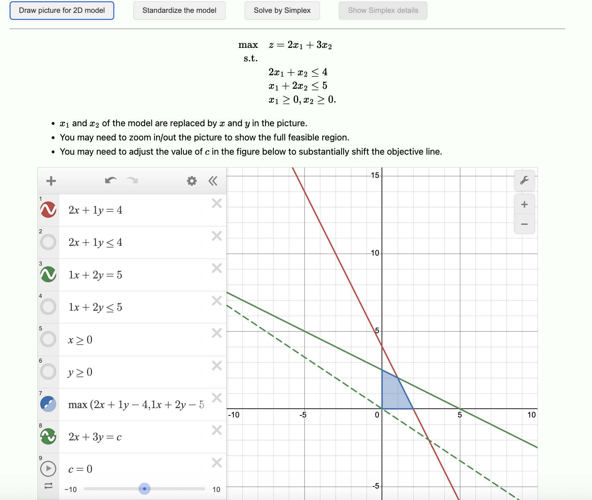
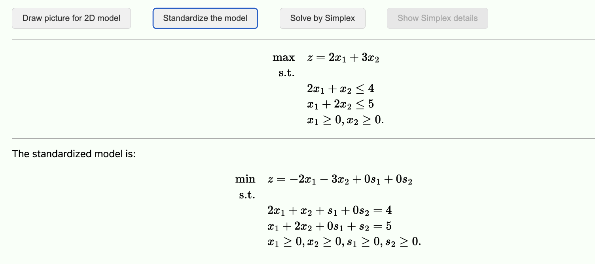
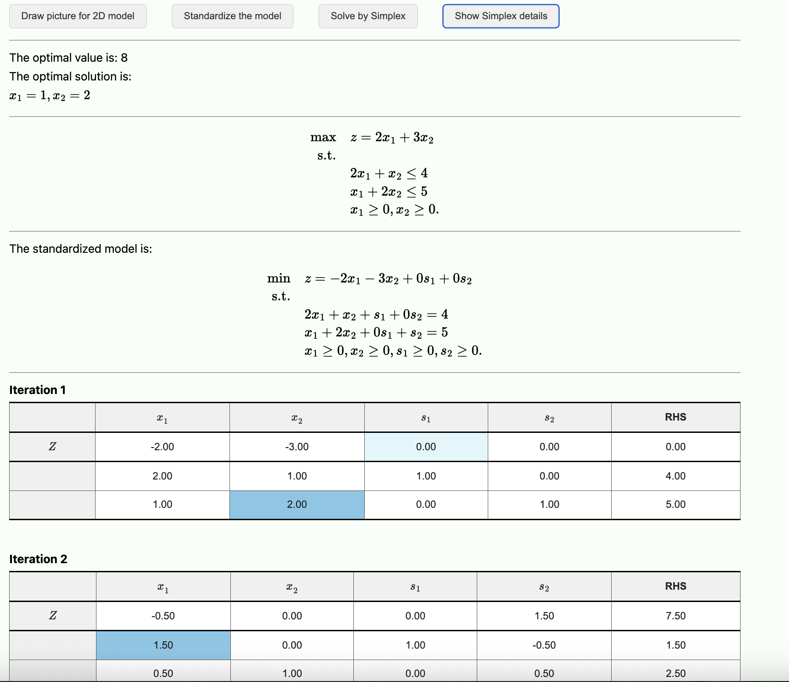

An online solver including Simplex and graphic method to solve some simple linear programming problems.

- The backend is implemented in C++, and the frontend in JavaScript.
- Maybe helpful for teaching.

## Graphic method

## Standardize the model

## Solve the model by Simplex and show each tableau

